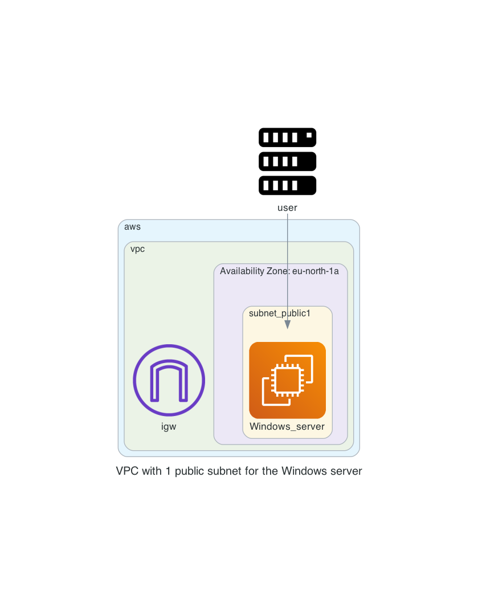

# aws_windows_server

This repository can be used to create a Windows server with a public IP which can only be accessed by the public IP address you use to create the environment. It is easy to have a windows server to test things with if you primary machine is Linux/MacOS. 

- Create a VPC network with a subnet, security group, internet gateway
- Create a EC2 instance with a Windows image

# Diagram

  

# Prerequisites

## AWS
We will be using AWS. Make sure you have the following
- AWS account  
- Install AWS cli [See documentation](https://docs.aws.amazon.com/cli/latest/userguide/install-cliv2.html)

## Install terraform  
See the following documentation [How to install Terraform](https://learn.hashicorp.com/tutorials/terraform/install-cli)

# How to

- Clone the repository to your local machine
```sh
git clone https://github.com/munnep/aws_windows_server.git
```
- Go to the directory  
```sh
cd aws_windows_server
```
- Set your AWS credentials
```
export AWS_ACCESS_KEY_ID=
export AWS_SECRET_ACCESS_KEY=
export AWS_SESSION_TOKEN=
```
- create a file called `variables.auto.tfvars` with the following contents and your own values
```hcl
tag_prefix               = "patrick-windows"                          # TAG prefix for names to easily find your AWS resources
region                   = "eu-north-1"                               # Region to create the environment
vpc_cidr                 = "10.229.0.0/16"                            # subnet mask that can be used 
ami                      = "ami-0ea09628f60446bad"                    # AMI of Windows Server 2022 
public_key               = "ssh-rsa AAAAB3Nza"                        # The public key for you to connect to the server over SSH
```
- Terraform initialize
```sh
terraform init
```
- Terraform plan
```sh
terraform plan
```
- Terraform apply
```sh
terraform apply
```
- Terraform output should create 10 resources and show you the public IP you can use to connect to the Windows Server with RDP
```sh
Apply complete! Resources: 10 added, 0 changed, 0 destroyed.

Outputs:

windows_password = "very_secret"
windows_public-ip = "13.50.113.42"
windows_user = "administrator"
```
- Use the ip address to connect to the windows machine using RDP
- Remove everything by using terraform destroy
```sh
terraform destroy
```

# TODO


# Done

- [x] build network according to the diagram
- [x] use standard Windows Server 2022 
- [x] create a virtual machine in a public network with public IP address.
    - [x] firewall inbound are all from user building external ip
    - [x] firewall outbound rules
- [x] create an elastic IP to attach to the instance


